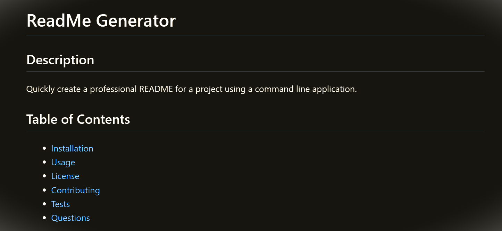

# ReadME

## Description
Create a professional readme using command line

## Table of Contents
* [Installation](#installation)
* [Usage](#usage)
* [License](#license)
* [Contributing](#contributing)
* [Tests](#tests)
* [Questions](#questions)

## Installation
Inquirer 8.2.4 will be needed in your package json

## Usage
Run this program in node terminal

## Screenshot

## License
MIT

## Contributing
na

## Tests
na

## Questions
* GitHub: https://github.com/jennajay
* Email: nope@gmail.com